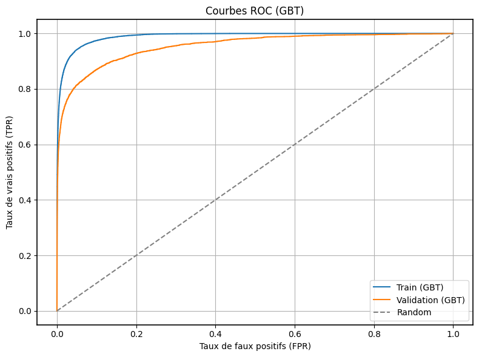

# Détection de fraude bancaire (PySpark)

> Pipeline de classification **PySpark / MLlib** sur **IEEE-CIS (Kaggle)** :  
> ~590 k transactions, **≈ 400 variables disponibles** après fusion (`transaction` + `identity`),  
> **3,5 %** de fraudes (déséquilibre marqué), variables largement anonymisées.

<!-- Optionnel : ajoute la capture si tu la poses dans docs/ -->
<!--  -->

---

##  Objectif & périmètre

Construire un pipeline **distribué** et **reproductible** pour prédire `isFraud` sur un jeu de données
large et hétérogène, **sans analyser exhaustivement chaque variable** : l’EDA sert à **cibler un
sous-ensemble de variables réellement informatives**, puis on optimise le modèle (sélection,
tuning **manuel** et **calibration du seuil**) en tenant compte du **déséquilibre (~3,5 %)**.

---

##  Méthodologie (6 étapes)

1) **Prétraitement initial**  
   - Chargement `train_transaction` et `train_identity`  
   - **Fusion** (LEFT JOIN) sur `TransactionID`  
   - **EDA “brute”** : structure, typage, taux de fraude, détection d’anomalies simples

2) **Nettoyage ciblé**  
   - Suppression des colonnes peu informatives (beaucoup de NaN / constantes)  
   - Création d’indicateurs **`has_X`** pour colonnes très incomplètes  
   - **Imputation** : médiane (numériques), `"unknown"` (catégorielles)

3) **Analyse exploratoire avancée (EDA)**  
   - Relations avec `isFraud` (ex. `TransactionAmt`, `D1`, `C1`, `ProductCD`, `card4`, `card6`, domaines email…)  
   - Recherche de **patterns**, effets de seuil, corrélations, **groupes à risque**  
   - L’EDA **guide** la suite : on **cible** des familles/variables utiles (on ne balaie **pas** “les 400” une par une)

4) **Feature Engineering (FE)**  
   - Dérivées & ratios : `log1p_TransactionAmt`, `C1/D1`, `day`, `is_weekend`…  
   - **Flags métier** : `is_product_C`, `card4_card6`, `is_high_amount`, `is_recent_activity`, `is_recent_intense`, etc.  
   - **Encodage** :  
     - faible cardinalité → `StringIndexer` + `OneHotEncoder`  
     - cardinalité élevée (emails) → **frequency encoding**  
   - **Assemblage** : `VectorAssembler` (+ `StandardScaler` si pertinent)

5) **Modélisation & déséquilibre**  
   - **Split** 80/20 (seed fixe)  
   - **Pondération** des classes via `weightCol`  
   - **Benchmark** : Logistic Regression (baseline), Random Forest, **GBT**

6) **Optimisation & sélection**  
   - **Sélection** de variables (importances GBT : globales / par familles / `Vxx` + filtre simple)  
   - **Tuning manuel** ciblé (ex. `maxDepth`, `maxIter`) sur sous-échantillon  
   - **Calibration du seuil** pour optimiser le compromis précision/rappel

---

##  Stack

- **Spark / PySpark (MLlib)** : préparation, pipeline, modèles  
- **Python** : pandas, numpy, **scipy** (tests statistiques : χ², etc.), matplotlib/seaborn  
- **Superset** : visualisation EDA & suivi des indicateurs (**pas** en temps réel)  
- *(Optionnel)* **SHAP** sur un échantillon Pandas (proxy sklearn) pour interprétabilité

---

##  Données

Compétition **IEEE-CIS Fraud Detection** (Kaggle).  
Les fichiers **ne sont pas versionnés** (licence) :
- `train_transaction.csv`
- `train_identity.csv`

> Placez les données dans `./data/` (répertoire ignoré par git).

---

##  Résultats (validation)

| Modèle            | ROC-AUC | PR-AUC | F1   | Précision | Rappel |
|-------------------|:------:|:-----:|:----:|:--------:|:------:|
| **GBT (optimisé)**| **0.954** | **0.74** | **0.69** | **0.72** | **0.67** |

**Modèle retenu** : `GBTClassifier` (**maxDepth = 10**, **maxIter = 100**, **seuil = 0.8**).  
Le gain vient des **features ciblant les faux positifs**, de la **sélection de variables**, du **tuning**
et de la **calibration du seuil**.

---

## Visualisations clés

| Figure | Commentaire rapide |
|:--|:--|
|  | **Précision–Rappel (val.)** : courbe nettement au-dessus de 0 → le modèle capte bien les fraudes malgré le déséquilibre (PR-AUC ≈ **0.74**). |
|  | **ROC train vs val.** : AUC train ≈ **0.98**, val. ≈ **0.95**. Léger écart → un peu d’overfit mais la généralisation reste solide (loin d’un modèle aléatoire). |
|  | **Choix du seuil** : pic **F1 ≈ 0.69** vers **0.84–0.85** → à ce seuil, **précision ~0.72**, **rappel ~0.67** (bon compromis pour limiter les faux positifs). |
|  | **Matrice (val., seuil 0.84)** : **TP=2 646**, **FP=743**, **FN=1 610**, **TN=113 109** → erreurs concentrées côté rappel (coût FN à surveiller). |
|  | **Gain cumulatif** : en scorant par ordre décroissant, une petite fraction de la population capture la majorité des fraudes → très bon pour des contrôles ciblés. |
|  | **Interprétabilité (SHAP, échantillon)** : influence forte de `TransactionAmt`, `card1`, `log1p_D15`, `C13`, `V257`, etc. → cohérent et exploitable pour l’analyse métier. |

### Bilan rapide
- Le modèle **n’est pas aléatoire** (PR-AUC **0.74**, ROC-AUC **0.95** en validation).  
- Seuil opérationnel retenu ≈ **0.84–0.85** → **F1 ~0.69**, **Precision ~0.78**, **Recall ~0.62**.  
- Léger **overfit** mais accepté pour un premier jet. Calibration **perfectible**.

### Pistes d’amélioration
- **Calibration des probabilités** si elles sont utilisées côté produit : *isotonic* ou *Platt scaling* sur un jeu de calibration (puis évaluation sur un jeu tenu-out).
- **Seuils dépendants du coût** (matrice coût FP/FN) ou **seuils par segment** (ex. canal, pays, device).
- **Ré-échantillonnage / pondération** : ajuster `weightCol`, downsample des non-fraudes, ou entraînement par mini-batches pondérés.
- **Validation temporelle** (split par date) pour mieux estimer la dérive et éviter la fuite d’info.
- **Features** supplémentaires/robustes : fenêtres temporelles (fréquence d’achats), ratios, encodages fréquence stables.
- **Surveillance en prod** : suivi PR-AUC/PR@k, drift des features/labels, ré-entraînement périodique.


---


##  Prise en main

```bash
# 0) Cloner
git clone https://github.com/elfahad98/ieee-fraud-pyspark.git
cd ieee-fraud-pyspark

# 1) Environnement (ex. venv)
python -m venv .venv
# Linux/Mac
source .venv/bin/activate
# Windows
# .venv\Scripts\activate
pip install -r requirements.txt

# 2) Données (non versionnées) : déposer dans ./data/
# data/train_transaction.csv
# data/train_identity.csv

# 3) Lancer
# - Notebook principal :
#   notebooks/fraud_detection_modeling1.ipynb
```

---

## 👤 Auteur

Projet réalisé par **COMBO El-Fahad** – Université de Caen (2025).  
Contact : `el-fahad.combo@etu.unicaen.fr`

---

## 📄 Licence

Ce projet est sous licence **MIT**. Voir le fichier `LICENSE`.
